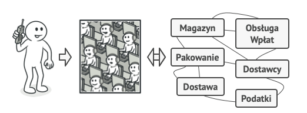
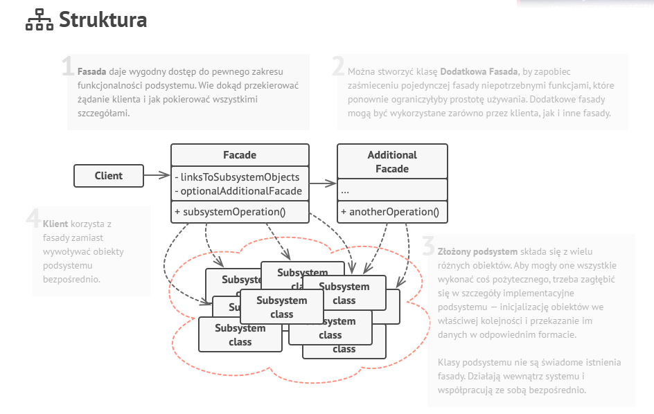

(1)Cel

Fasada jest strukturalnym wzorcem projektowym, który wyposaża bibliotekę, framework lub inny złożony zestaw klas w uproszczony interfejs.
___

(2)Problem

Problem: złożoność systemu i ścisłe powiązania (tight coupling)
W dużych systemach:

- mamy wiele klas i obiektów, które współdziałają,

- logika biznesowa musi znać szczegóły implementacji tych klas,

- musimy pamiętać o kolejności wywołań metod, zależności między klasami itd.

To prowadzi do:

- chaosu w kodzie,

- trudnego w utrzymaniu kodu,

- większego ryzyka błędów,

- braku przejrzystości dla programisty czy klienta API.
___

(3)Rozwiązanie
Fasada to klasa stanowiąca prosty interfejs dla złożonego podsystemu, zawierającego mnóstwo ruchomych części. Fasada może dawać ograniczoną funkcjonalność, w porównaniu z korzystaniem z elementów podsystemu bezpośrednio, ale za to eksponuje tylko te możliwości, których klient naprawdę potrzebuje.

===Zalety wzorca Fasada===

- Fasada upraszcza korzystanie z rozbudowanego lub skomplikowanego systemu, dostarczając prosty interfejs. 

- Klasy korzystające z podsystemów nie są z nimi bezpośrednio powiązane – komunikują się z nimi poprzez fasadę.

- Zastosowanie fasady pomaga w uporządkowaniu kodu, oddzieleniu warstw aplikacji i zwiększeniu przejrzystości architektury.

===Wady wzorca Fasada===

- Potencjalna nadmierna centralizacja (boski obiekt)

- Fasada upraszcza interfejs, ale może też ograniczyć dostęp do bardziej zaawansowanych funkcji. Użytkownicy mogą być zmuszeni do obchodzenia fasady, jeśli jej interfejs nie jest wystarczający.

- W mniejszych projektach wprowadzenie fasady może być przesadne 
___

(4)Analogia do prawdziwego życia

Gdy dzwonisz do sklepu aby złożyć zamówienie, biuro jest twoją fasadą dla wszystkich usług i oddziałów tego sklepu. Pracownik sklepu, czy automat zgłoszeniowy, stanowią prosty interfejs głosowy do systemu zamawiania, płacenia i różnych usług dostawczych.
___

(5)UML

